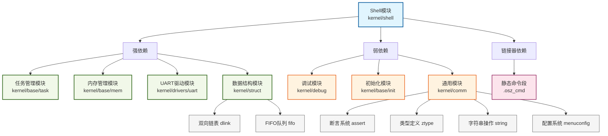

## 模块间依赖

Shell模块的依赖关系清晰地反映了其作为系统交互层的设计定位。其依赖关系如下：

**图表说明**：
- **Shell模块**（蓝色）：核心Shell模块，位于依赖关系的顶层
- **强依赖模块**（绿色）：Shell正常运行所必需的模块，缺少这些模块将导致核心功能失效
- **弱依赖模块**（橙色）：提供增强功能的模块，但不是核心功能所必需的
- **链接器依赖**（粉色）：编译期和链接期的依赖
- **子模块**（灰色）：父模块的内部组件或子功能

Shell模块与以下系统模块存在紧密耦合：

| 模块 | 依赖类型 | 具体依赖内容 |
|------|----------|--------------|
| **任务管理模块** (`kernel/base/task`) | 强依赖 | 使用`osz_create_task()`创建Shell任务、`osz_task_resume()`恢复任务、`osz_msleep()`主动睡眠 |
| **内存管理模块** (`kernel/base/mem`) | 强依赖 | 使用`osz_malloc()`/`osz_free()`分配/释放任务栈、历史命令缓冲区、临时缓冲区等 |
| **UART驱动模块** (`kernel/drivers/uart`) | 强依赖 | 使用`drv_uart_putc()`输出字符到终端，实现人机交互 |
| **数据结构模块** (`kernel/struct`) | 强依赖 | 使用双向链表(`dlink`)管理命令注册，使用FIFO队列缓冲输入字符 |
| **调试模块** (`kernel/debug`) | 弱依赖 | 使用`printf()`函数输出提示信息和错误信息 |
| **初始化模块** (`kernel/base/init`) | 弱依赖 | 使用`MODULE_INIT()`宏实现模块自动初始化 |

### 头文件依赖

Shell模块直接包含以下头文件，构成了其功能实现的基础：

| 头文件 | 来源模块 | 主要用途 |
|--------|----------|----------|
| `#include "uart.h"` | `kernel/drivers/uart/include/ext/uart.h` | UART驱动接口，提供`drv_uart_putc()`函数用于字符输出 |
| `#include "task.h"` | `kernel/base/task/include/task.h` | 任务管理接口，用于创建Shell任务、睡眠等操作 |
| `#include "mem.h"` | `kernel/base/mem/include/mem.h` | 内存管理接口，提供`osz_malloc()`、`osz_free()`、`osz_zalloc()`等动态内存操作 |
| `#include "string.h"` | `kernel/comm/include/string.h` | 字符串操作接口，提供`strlen()`、`strncmp()`、`memcpy()`、`memset()`等函数 |
| `#include "shell.h"` | `kernel/shell/include/shell.h` | Shell模块自身定义，包含数据结构、宏定义和函数声明 |
| `#include "inner_shell_err.h"` | `kernel/shell/include/inner_shell_err.h` | Shell内部错误码定义 |

**间接依赖**（通过`shell.h`包含）：
- `#include "menuconfig.h"` - 配置系统头文件
- `#include "comm.h"` - 通用头文件集合（包含assert、ztype、stdint等）
- `#include "dlink.h"` - 双向链表数据结构
- `#include "fifo.h"` - FIFO队列数据结构

### 函数/宏依赖

Shell模块使用的外部函数和宏分类如下：

#### 任务管理函数
- `osz_create_task()` - 创建Shell任务
- `osz_task_resume()` - 恢复任务执行
- `osz_msleep()` - 任务主动睡眠（20ms周期）

#### 内存管理函数
- `osz_malloc()` - 动态分配内存（任务栈、临时缓冲区）
- `osz_free()` - 释放动态分配的内存
- `osz_zalloc()` - 分配并清零内存（历史命令、参数数组）

#### 字符串操作函数
- `strlen()` - 获取字符串长度
- `strncmp()` - 字符串比较（命令匹配）
- `strncpy()` - 字符串复制
- `memcpy()` - 内存复制
- `memset()` - 内存清零

#### 数据结构操作
- **双向链表操作**：
  - `dlink_init()` - 初始化链表头
  - `dlink_insert_tail()` - 向链表尾部插入节点
  - `DLINK_FOREACH()` - 链表遍历宏
  - `STRUCT_ENTRY()` - 通过成员指针获取结构体指针
- **FIFO队列操作**：
  - `fifo_create()` - 创建FIFO队列
  - `fifo_is_empty()` - 判断队列是否为空
  - `fifo_write()` - 向队列写入数据
  - `fifo_read()` - 从队列读取数据

#### 调试输出函数
- `printf()` - 格式化输出（通过`SHELL_PRINT`宏包装）
- `drv_uart_putc()` - 单个字符输出

#### 系统宏
- `MODULE_INIT()` - 模块初始化宏（级别L4）
- `ASSERT()` - 断言检查宏

### 外部符号依赖

Shell模块依赖以下链接器定义的符号，实现静态命令注册机制：

| 符号 | 类型 | 作用 |
|------|------|------|
| `extern UINT32 __cmd_start;` | 链接器符号 | 静态命令段(`.osz_cmd`)起始地址 |
| `extern UINT32 __cmd_end;` | 链接器符号 | 静态命令段(`.osz_cmd`)结束地址 |
| `g_cmd_start` | 全局变量 | 存储`__cmd_start`的地址 |
| `g_cmd_end` | 全局变量 | 存储`__cmd_end`的地址 |

### 配置依赖

Shell模块的行为受以下配置项控制（定义在`menuconfig.h`中）：

| 配置项 | 默认值 | 作用 |
|--------|--------|------|
| `OSZ_CFG_SHELL_HISTORY_CMD_NUM` | 10 | 历史命令记录数量 |
| `SHELL_BUFFER_MAX_NUM` | 0x400 (1024) | 输入缓冲区大小 |
| `SHELL_FIFO_MAX_SIZE` | 0x40 (64) | FIFO队列大小 |

### 依赖强度判断标准

在分析Shell模块的依赖关系时，我们根据以下标准判断依赖的强度：

#### 强依赖（Strong Dependency）判断标准：
1. **功能完整性依赖**：如果缺少该模块，Shell的核心功能将无法正常工作
   - 示例：没有任务管理模块，Shell无法创建独立任务运行
   - 示例：没有内存管理模块，Shell无法分配缓冲区存储输入和历史命令

2. **运行时必需依赖**：在Shell的正常运行过程中必须使用的模块
   - 示例：UART驱动模块是Shell与用户交互的唯一通道
   - 示例：数据结构模块提供命令管理和输入缓冲的基础设施

3. **接口紧密耦合**：Shell直接调用该模块的多个关键接口函数
   - 示例：任务管理模块的`osz_create_task()`、`osz_task_resume()`、`osz_msleep()`
   - 示例：内存管理模块的`osz_malloc()`、`osz_free()`、`osz_zalloc()`

4. **替代成本高**：很难找到或实现替代方案
   - 示例：UART驱动与硬件紧密相关，替换成本极高

#### 弱依赖（Weak Dependency）判断标准：
1. **功能增强性依赖**：该模块提供了增强功能，但不是核心功能所必需的
   - 示例：调试模块的`printf()`提供了更好的用户反馈，但理论上可以用简单字符输出替代

2. **初始化/配置依赖**：仅在模块初始化或配置阶段使用
   - 示例：初始化模块的`MODULE_INIT()`宏仅在系统启动时使用一次

3. **可选的工具性依赖**：提供了便利工具，但有替代方案
   - 示例：`printf()`格式化输出可以用多个`drv_uart_putc()`调用替代

4. **接口简单单一**：仅使用该模块的少数简单接口
   - 示例：仅使用调试模块的`printf()`函数

#### 具体案例分析：
1. **任务管理模块（强依赖）**：
   - Shell作为独立任务运行，依赖任务管理模块创建、调度任务
   - 缺少该模块，Shell无法作为独立实体运行
   - 使用了多个关键接口：创建、恢复、睡眠

2. **内存管理模块（强依赖）**：
   - Shell需要动态分配内存存储历史命令、参数数组、临时缓冲区
   - 缺少该模块，Shell无法管理动态资源
   - 使用了分配、释放、清零等多个关键接口

3. **UART驱动模块（强依赖）**：
   - Shell与用户交互的唯一途径
   - 缺少该模块，Shell无法接收输入和输出结果
   - 与硬件紧密耦合，替代成本高

4. **数据结构模块（强依赖）**：
   - 提供命令管理和输入缓冲的基础数据结构
   - 缺少该模块，Shell无法高效管理命令和缓冲输入
   - 使用了链表和队列两种关键数据结构

5. **调试模块（弱依赖）**：
   - 仅使用`printf()`函数提供格式化输出
   - 理论上可以用多个`drv_uart_putc()`调用替代
   - 提供了便利性，但不是功能完整性所必需的

6. **初始化模块（弱依赖）**：
   - 仅使用`MODULE_INIT()`宏实现自动初始化
   - 可以在其他地方手动调用初始化函数替代
   - 仅在系统启动时使用一次

#### 依赖强度的影响：
1. **架构设计**：强依赖模块需要优先设计和实现
2. **测试策略**：强依赖模块需要更严格的集成测试
3. **维护成本**：强依赖模块的变更可能影响Shell模块
4. **可移植性**：弱依赖模块更容易替换，提高系统可移植性

依赖强度分析有助于理解模块间的耦合程度，指导系统架构设计和维护决策。