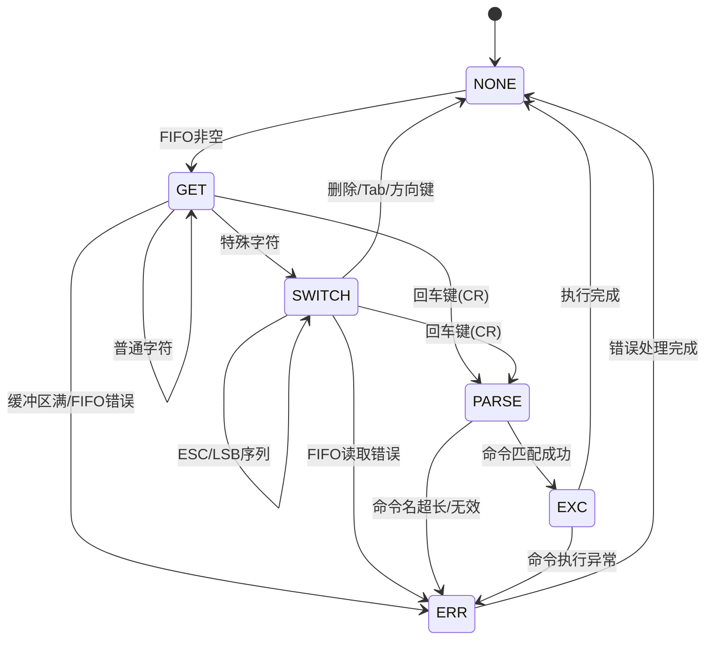
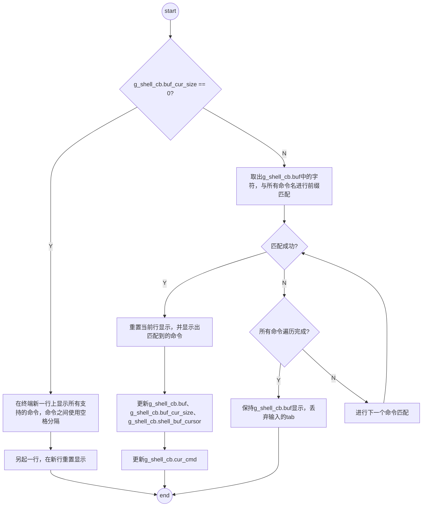
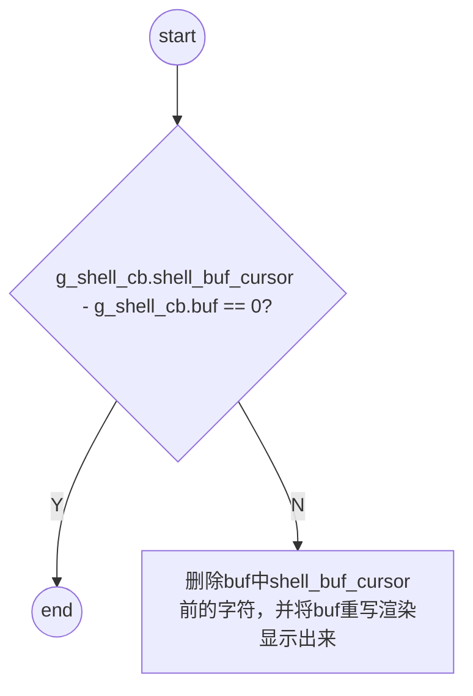
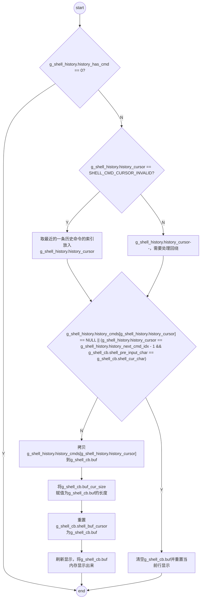
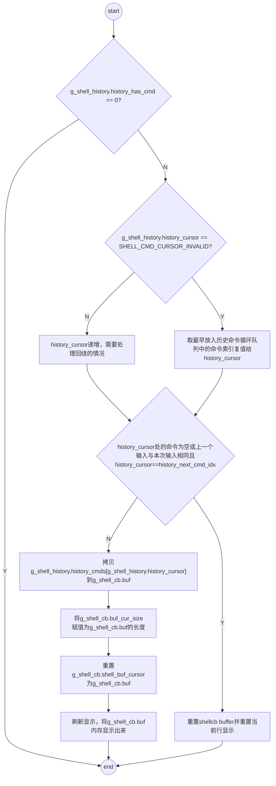
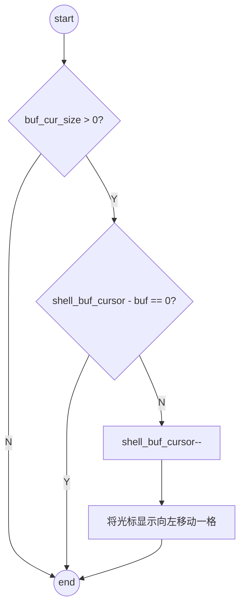
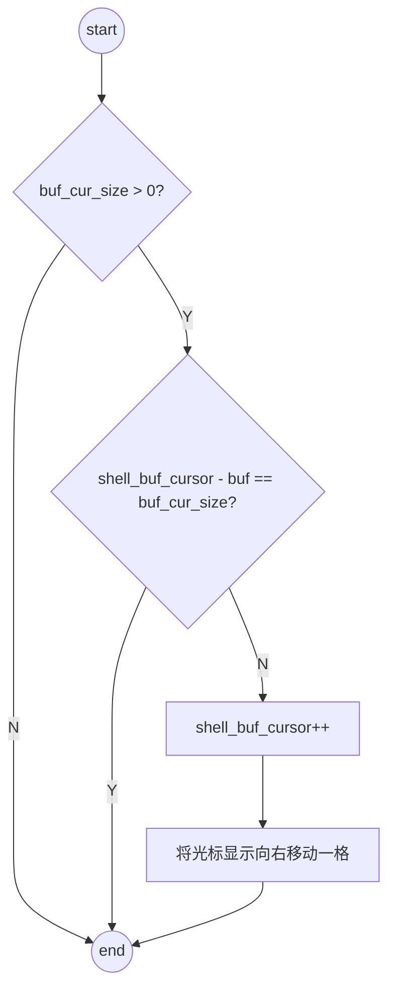
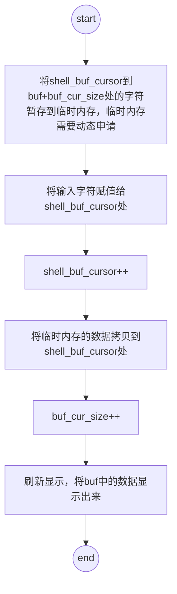

## 状态机设计原理

Shell状态机是模块的核心控制逻辑，采用**事件驱动**的有限状态机模型，通过六个明确的状态实现命令处理的完整生命周期：



**状态详细说明**：

| 状态 | 触发条件 | 主要操作 | 下一状态 |
|------|----------|----------|----------|
| **NONE** | 系统空闲 | 检测FIFO队列，20ms主动睡眠 | GET（FIFO非空） |
| **GET** | FIFO中有字符 | 读取字符，区分普通/特殊字符 | SWITCH（特殊字符）<br>PARSE（回车键）<br>GET（普通字符）<br>ERR（错误） |
| **SWITCH** | 识别到特殊字符 | 处理删除、Tab、方向键、ESC序列 | NONE（处理完成）<br>PARSE（回车键）<br>SWITCH（ESC序列）<br>ERR（错误） |
| **PARSE** | 收到回车键 | 解析命令名和参数，匹配注册命令 | EXC（匹配成功）<br>ERR（匹配失败） |
| **EXC** | 命令匹配成功 | 调用命令回调函数，执行命令逻辑 | NONE（执行完成） <br>ERR（命令返回失败）|
| **ERR** | 发生错误 | 清理缓冲区，报告错误码，重置状态 | NONE（恢复完成） |

**状态转换事件矩阵**：

| 事件 | NONE→GET | GET→SWITCH | GET→PARSE | SWITCH→NONE | SWITCH→PARSE | PARSE→EXC | PARSE→ERR | 任何→ERR |
|------|----------|------------|-----------|-------------|--------------|-----------|-----------|----------|
| **FIFO非空** | ✓ | - | - | - | - | - | - | - |
| **普通字符** | - | - | - | - | - | - | - | - |
| **特殊字符** | - | ✓ | - | - | - | - | - | - |
| **回车键(CR)** | - | - | ✓ | - | ✓ | - | - | - |
| **删除/Tab/方向键** | - | - | - | ✓ | - | - | - | - |
| **ESC序列** | - | - | - | - | - | - | - | - |
| **命令匹配成功** | - | - | - | - | - | ✓ | - | - |
| **命令匹配失败** | - | - | - | - | - | - | ✓ | - |
| **缓冲区满** | - | - | - | - | - | - | - | ✓ |
| **FIFO错误** | - | - | - | - | - | - | - | ✓ |
| **命令执行失败** | - | - | - | - | - | - | - | ✓ |

**设计哲学**：
1. **确定性状态转换**：每个状态有明确的进入条件、处理逻辑和退出条件，确保行为可预测
2. **错误隔离机制**：错误状态独立于正常流程，防止错误传播污染正常状态
3. **事件驱动响应**：状态转换由外部事件（字符输入）触发，而非轮询检测，提高效率
4. **最小状态原则**：仅定义必要的六个状态，避免状态爆炸，保持逻辑清晰
5. **自恢复能力**：错误状态自动清理并返回初始状态，确保系统持续可用

**技术优势**：
- **状态隔离**：每个状态封装特定功能，降低模块间耦合度
- **可测试性**：状态机可独立测试，便于验证各状态转换逻辑
- **可维护性**：新增功能只需在相应状态添加处理逻辑，不影响其他状态
- **实时性**：事件驱动模型减少不必要的状态检查，提高响应速度

## 命令注册机制

Shell采用**混合式命令管理**策略，结合静态效率与动态灵活性：

### 静态注册（编译期）
- **实现原理**：利用链接器段(`.osz_cmd`)收集所有`REGISTER_STATIC_CMD`宏定义的命令
- **技术细节**：
  ```c
  #define REGISTER_STATIC_CMD(cmd_, func_, max_argc_) \
      CMD_PARAMS cmd_node_##cmd_ SECTION_STATIC_CMD = { \
          .cmd_name = #cmd_, \
          .cmd_func = func_, \
          .argc = max_argc_, \
      };
  ```
- **优势**：零运行时开销，命令在系统启动时自动注册
- **适用场景**：系统核心命令、常用工具命令

### 动态注册（运行时）
- **实现原理**：通过`shell_register_cmd()`函数将命令节点插入双向链表
- **数据结构**：`CMD_NODE`链表，支持O(n)查找（命令数量有限，可接受）
- **优势**：支持模块热插拔、动态加载命令
- **适用场景**：可加载模块、临时命令、调试工具

### 命令查找策略
- **前缀匹配**：支持Tab键命令补全，基于当前输入前缀过滤候选命令
- **精确匹配**：执行时进行全命令名匹配，确保准确性
- **参数管理**：动态分配参数数组，支持变长参数传递

## 输入处理机制

Shell输入处理采用**光标感知的编辑模型**，支持丰富的交互功能：

### 缓冲区管理
- **环形缓冲区**：1024字节固定缓冲区，使用位域精确记录容量和大小
- **光标指针**：`shell_buf_cursor`跟踪当前编辑位置，支持插入、删除、移动
- **容量控制**：`buf_cur_size`（10位）记录当前大小，`shell_capcity`（11位）记录最大容量

### 特殊字符处理
- **删除键(0x7F)**：支持光标位置删除，自动重排后续字符
- **Tab键(0x9)**：命令补全功能，显示匹配命令列表或自动补全
- **回车键(0xD)**：触发命令解析和执行
- **方向键**：ESC序列解析（ESC+[+A/B/C/D），支持历史导航和光标移动

### 异步输入流水线
```
UART中断 → FIFO写入 → shell_write_fifo() → FIFO缓冲 → shell_read_fifo() → 状态机处理
```
- **生产者-消费者模型**：UART中断为生产者，Shell任务为消费者
- **流量控制**：FIFO满时丢弃新字符，防止缓冲区溢出
- **实时响应**：20ms任务睡眠周期，平衡响应速度与CPU占用

## 历史记录管理

历史记录系统采用**循环缓冲区算法**，实现有限内存下的无限历史感知：

### 存储策略
- **循环数组**：固定大小历史命令数组（默认10条），新命令覆盖最旧命令
- **动态内存**：每个历史命令独立分配内存，按需释放
- **去重机制**：避免连续相同命令重复记录，节省内存

### 导航算法
- **光标索引**：`history_cursor`跟踪当前浏览位置，255表示无效（空行）
- **边界处理**：上下箭头智能处理数组边界，支持循环导航
- **空命令跳过**：自动跳过NULL条目，确保导航连续性

### 显示优化
- **清屏处理 **：使用`"\033[2K\r"`字符串清除一行；
- **光标移动**：使用`"\033[1D"`左移光标，使用`"\033[1C"`右移光标；

## 错误处理机制

Shell采用**集中式错误处理**与**状态恢复**策略：

### 错误分类
- **缓冲区错误**：`SHELL_BUFFER_FULL_ERR` - 输入缓冲区满
- **命令错误**：`SHELL_CMD_KEY_OVER_LEN_ERR` - 命令名超长
- **参数错误**：`SHELL_PARAMS_NAME_INVALID_ERR` - 命令名无效
- **回调错误**：`SHELL_PARAMS_CALLBACK_INVALID_ERR` - 回调函数为空
- **FIFO错误**：`SHELL_FIFO_READ_ERR` - FIFO读取失败

### 恢复策略
- **状态重置**：错误发生后自动清理缓冲区，重置光标和状态
- **错误报告**：显示错误码（十六进制），便于调试
- **快速恢复**：立即返回`NONE`状态，准备接收新输入

## 特殊按键处理流程

### Tab键处理

Tab键用于命令补全，基于**前缀匹配算法**。当存在多个命令前缀相同时，Tab键可显示当前前缀下的所有命令。具体处理逻辑如下：


### Back键处理

Back键用于删除当前光标处的字符。具体处理逻辑如下：


### 方向上键处理

方向上键用于回溯最近最新使用过的历史命令，具体处理逻辑如下：



### 方向下键处理

方向下键用于回溯最近最老使用过的历史命令，具体处理逻辑如下：


> 其中：
> 1. 最早放入历史命令循环队列的命令：若循环队列未回绕过（即g_shell_history.history_next_cmd_idx索引处的命令为NULL），则索引0为最近最老的历史命令；否则索引history_next_cmd_idx处的命令为最近最老的历史命令；

### 方向左键处理

方向左键用于向左移动显示光标，具体处理逻辑如下：


### 方向右键处理

方向邮件用于向右移动显示光标，具体处理逻辑如下：


### 插入数据处理

在光标所在位置插入一个字符，具体处理如下：
